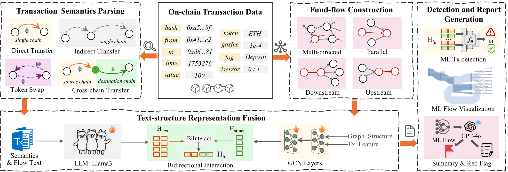

# FLOWSHIELD

This is the source code of the ICDM '26 paper **"FLOWSHIELD: Cryptocurrency anti-money laundering with transaction semantics parsing and fund flow tracking"**.



BybitML is publicly available on [OSF](https://osf.io/nx7aj/overview?view_only=663038fbea43491bb4010011c7f28b23).

## Configuration

Set the following environment variables before running scripts that access external services:

- `INFURA_PROJECT_ID`
- `ETHERSCAN_API_KEY`
- `OPENAI_API_KEY`

Never commit API keys or local `.env` files.

## Data

Due to repository storage limitations, the data are hosted separately. BybitML is publicly available on [OSF](https://osf.io/nx7aj/overview?view_only=663038fbea43491bb4010011c7f28b23).

## Code

The source code is organized into two directories:

- [`FlowShield_BTC/`](FlowShield_BTC/): Bitcoin processing and embedding scripts.
- [`FlowShield_ETH/`](FlowShield_ETH/): Ethereum processing, embedding, laundering detection, and suspicious activity report (SAR) generation scripts.

Both directories contain `P1_semantic_awareness`, `P2_fund_flow_awareness`, `P3_1_semantics_embedding`, and `P3_2_fund_flow_embedding` for semantic parsing, fund-flow construction, and representation learning. `FlowShield_ETH/` additionally includes `P4_SARs_generation`, which contains the main detection script, `S1_FlowShield.py`, and scripts for flow visualization and SAR generation.

---

## Usage

### Quick Start

Download the data, prepare the required embeddings, and update the input and output paths in the scripts to match your local setup. Then run the main detection script:

```bash
python FlowShield_ETH/P4_SARs_generation/S1_FlowShield.py
```

## Citation

If you compare with, build on, or use aspects of this work, please cite the following:

```bibtex
@inproceedings{fu2026flowshield,
  title={{FLOWSHIELD}: Cryptocurrency anti-money laundering with transaction semantics parsing and fund flow tracking},
  author={Fu, Qishuang and Deppeler, Andreas and Liu, Joseph K. and Liu, Yixin and Pan, Shirui and Wang, Qin and Wang, Weiqing and Yuen, Tsz Hon},
  booktitle={ICDM},
  year={2026}
}
```
